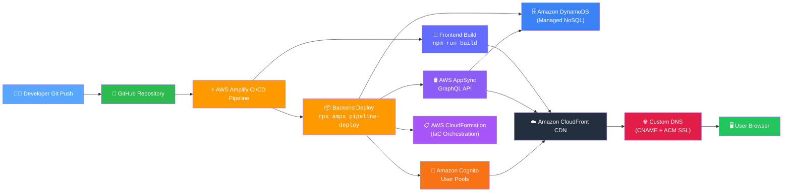

<div align="center">

# 🎾 Tennis Tournament Control Center

**Real-Time Tournament Management & Live Scoring Platform — Cloud-Native, Serverless, Fully Automated**

[](https://aws.amazon.com/amplify/)
[](https://react.dev/)
[](https://www.typescriptlang.org/)
[](https://vite.dev/)
[](https://aws.amazon.com/cdk/)
[](https://github.com/Ru-Dipity/Tennis-Score-Board/blob/main/LICENSE)
[](https://your-domain.com)

---

**A production-grade, full-stack tennis tournament system** that delivers real-time score updates, automated bracket generation, and responsive match displays — all hosted on **AWS Amplify** with global CDN acceleration, automated CI/CD, and custom domain with TLS/SSL.

</div>

---

## 📡 Architecture Overview



---

## ☁️ Cloud & DevOps Highlights

| Capability | Implementation |
|---|---|
| **Serverless Hosting** | Hosted on [AWS Amplify](https://github.com/Ru-Dipity/Tennis-Score-Board/blob/main/amplify.yml) with fully managed infrastructure — no servers to provision or maintain. |
| **Global CDN** | Content delivered via [Amazon CloudFront](https://aws.amazon.com/cloudfront/) edge locations for sub-50ms TTFB worldwide. |
| **Automated CI/CD** | GitOps-driven pipeline: every push to `main` triggers dependency install, TypeScript compilation, Vite production build, and incremental Amplify deployment. See [`amplify.yml`](https://github.com/Ru-Dipity/Tennis-Score-Board/blob/main/amplify.yml). |
| **Custom Domain & SSL** | CNAME-based DNS routing with [AWS Certificate Manager (ACM)](https://aws.amazon.com/certificate-manager/) — fully automated HTTPS certificate provisioning and renewal. |
| **Infrastructure as Code** | Backend defined via [AWS CDK](https://aws.amazon.com/cdk/) and orchestrated through [AWS CloudFormation](https://aws.amazon.com/cloudformation/) in [`amplify/`](https://github.com/Ru-Dipity/Tennis-Score-Board/tree/main/amplify) — auth, data models, and permissions are version-controlled and deployable. |
| **GraphQL API** | Real-time data layer via [AWS AppSync](https://aws.amazon.com/appsync/) with subscription support for live score updates. |
| **Managed NoSQL Database** | All tournament data persisted in [Amazon DynamoDB](https://aws.amazon.com/dynamodb/) — serverless, auto-scaling, single-digit-millisecond latency. |

---

## 🎯 Application Features

### 🏆 Tournament Modes
- **Knockout (Single Elimination)** — Automatic bracket generation with seeded draws, bye handling, and winner propagation.
- **Round Robin** — Group-stage standings with configurable group count and qualification slots per group.
- **Team Battle** — Responsive team-vs-team match panels with mobile/tablet-optimized CSS Flex/Grid layouts.

### 🎲 Match Management
- **Singles & Doubles** support with player and team registration.
- **Random Draw / Shuffle** — Random seeding for fair tournament starts.
- **Multiple Match Formats** — Single set, Best of 3, Best of 5.
- **Real-Time Score Entry** — Admin console with instant GraphQL subscription updates to visitor displays.

### 📊 Live Display
- **Bracket View** — Visual knockout bracket with round labels and match progression.
- **Standings Tables** — Round-robin group rankings with points, games won/lost, and tie-break logic.
- **Responsive Design** — Dedicated mobile/tablet layouts using CSS Grid and Flexbox compression.

### 🔐 Authentication & Authorization
- **Public Read-Only** — Visitors can view live tournaments without authentication.
- **Admin Console** — Email-based sign-in via Amazon Cognito with `admin` group write access for creating players, teams, tournaments, and entering scores.

---

## 🛠️ Tech Stack

### Cloud & Infrastructure

| Service | Purpose |
|---|---|
| [AWS Amplify](https://aws.amazon.com/amplify/) | Hosting, CI/CD pipeline, backend deployment |
| [Amazon CloudFront](https://aws.amazon.com/cloudfront/) | Global content delivery network (CDN) |
| [AWS AppSync](https://aws.amazon.com/appsync/) | Managed GraphQL API with real-time subscriptions |
| [Amazon DynamoDB](https://aws.amazon.com/dynamodb/) | Serverless NoSQL database — auto-scaling, millisecond latency |
| [Amazon Cognito](https://aws.amazon.com/cognito/) | Authentication, user pools, admin group management |
| [AWS Certificate Manager](https://aws.amazon.com/certificate-manager/) | Automated TLS/SSL certificate provisioning |
| [AWS CloudFormation](https://aws.amazon.com/cloudformation/) | Infrastructure as Code orchestration (via AWS CDK) |
| [AWS CDK](https://aws.amazon.com/cdk/) | Infrastructure as Code for backend resources |

### Frontend

| Technology | Purpose |
|---|---|
| [React 19](https://react.dev/) | UI component library |
| [TypeScript 5](https://www.typescriptlang.org/) | Type-safe application code |
| [Vite 5](https://vite.dev/) | Fast development server & production bundler |
| [AWS Amplify UI](https://ui.docs.amplify.aws/) | Pre-built React components for auth & data |
| [CSS3 Grid / Flexbox](https://developer.mozilla.org/en-US/docs/Web/CSS) | Responsive layout engine |

### Backend (Amplify Gen 2)

| File | Responsibility |
|---|---|
| [`amplify/data/resource.ts`](https://github.com/Ru-Dipity/Tennis-Score-Board/blob/main/amplify/data/resource.ts) | GraphQL schema — models (Player, Team, Tournament, Match, TournamentEntry), enums, authorization rules |
| [`amplify/auth/resource.ts`](https://github.com/Ru-Dipity/Tennis-Score-Board/blob/main/amplify/auth/resource.ts) | Cognito user pool configuration — email sign-in, admin group |
| [`amplify/backend.ts`](https://github.com/Ru-Dipity/Tennis-Score-Board/blob/main/amplify/backend.ts) | Backend composition — wires auth + data resources |

---

## 🚀 Getting Started — Local Development

### Prerequisites
- **Node.js** >= 18.x
- **npm** >= 9.x

### Steps

```bash
# 1. Clone the repository
git clone https://github.com/Ru-Dipity/Tennis-Score-Board.git
cd Tennis-Score-Board

# 2. Install dependencies
npm install

# 3. Start the Vite development server
npm run dev
```

The app will be available at **http://localhost:5173** with hot module replacement (HMR) enabled.

### Available Scripts

| Command | Description |
|---|---|
| `npm run dev` | Start local dev server with HMR |
| `npm run build` | TypeScript check + Vite production build → `dist/` |
| `npm run preview` | Preview production build locally |
| `npm run lint` | Run ESLint across the codebase |

---

## 🌩️ Cloud Deployment Guide

### 1. Connect Repository to AWS Amplify

1. Navigate to **AWS Amplify Console** → **Host web app**.
2. Select **GitHub** as the source provider and authorize access.
3. Choose the `Tennis-Score-Board` repository and `main` branch.

### 2. Configure Build Settings

Amplify automatically detects [`amplify.yml`](https://github.com/Ru-Dipity/Tennis-Score-Board/blob/main/amplify.yml). The pipeline executes:

```
Backend:  npm install → npx ampx pipeline-deploy
Frontend: npm install → npm run build
Artifacts: dist/
```

### 3. Set Up Custom Domain

1. In Amplify Console, go to **Domain management** → **Add domain**.
2. Enter your domain name (e.g., `scoreboard.yourclub.com`).
3. Amplify will:
   - Generate a **CNAME record** for your DNS provider.
   - Request an **ACM certificate** in `us-east-1` (required for CloudFront).
   - Automatically validate domain ownership via DNS.
4. Add the CNAME record to your DNS provider (e.g., Route 53, Cloudflare, Namecheap):
   ```
   scoreboard  CNAME  <amplify-provided-domain>.amplifyapp.com
   ```
5. Wait for DNS propagation and certificate issuance (typically 5–15 minutes).

### 4. Verify Deployment

- ✅ HTTPS is enforced automatically via CloudFront + ACM.
- ✅ Custom domain resolves to the Amplify-hosted app.
- ✅ Subsequent `git push` to `main` triggers incremental builds with zero-downtime deployment.

---

## 📁 Project Structure

```
Tennis-Score-Board/
├── amplify/                    # Backend (Amplify Gen 2 / AWS CDK)
│   ├── auth/
│   │   └── resource.ts         # Cognito user pool config
│   ├── data/
│   │   └── resource.ts         # GraphQL schema & auth rules
│   ├── backend.ts              # Backend composition
│   ├── package.json
│   └── tsconfig.json
├── src/                        # Frontend (React + TypeScript)
│   ├── lib/
│   │   └── tournament.ts       # Tournament logic engine
│   ├── App.tsx                 # Main app container
│   ├── App.css                 # Component styles
│   ├── index.css               # Global styles
│   └── main.tsx                # App entry point
├── public/                     # Static assets
├── amplify.yml                 # CI/CD pipeline definition
├── amplify_outputs.json        # Generated backend config
├── package.json                # Frontend dependencies & scripts
├── vite.config.ts              # Vite bundler config
├── tsconfig*.json              # TypeScript configurations
└── eslint.config.js            # ESLint flat config
```

---

## 🔄 CI/CD Pipeline

```yaml
# amplify.yml — Full pipeline definition
version: 1
backend:
  phases:
    build:
      commands:
        - npm install
        - npx ampx pipeline-deploy --branch $AWS_BRANCH --app-id $AWS_APP_ID
frontend:
  phases:
    preBuild:
      commands:
        - npm install
    build:
      commands:
        - npm run build
  artifacts:
    baseDirectory: dist
    files:
      - '**/*'
  cache:
    paths:
      - .npm/**/*
      - node_modules/**/*
```

**Pipeline Flow:**
1. **Trigger**: Push to `main` branch.
2. **Backend Phase**: Installs dependencies, synthesizes CDK app into CloudFormation templates, deploys stacks (Cognito, AppSync, DynamoDB tables).
3. **Frontend Phase**: Installs dependencies, runs `tsc` type-check, bundles with Vite.
4. **Artifact**: Outputs `dist/` to Amplify hosting.
5. **Serving**: Amplify uploads to S3 → invalidates CloudFront cache → global rollout.

---

## 🔐 Security & Permissions

| Access Level | Auth Provider | Operations |
|---|---|---|
| **Public (Visitor)** | API Key | Read-only: view tournaments, matches, standings |
| **Admin** | Cognito User Pools (`admin` group) | Full CRUD: players, teams, tournaments, matches |

All GraphQL mutations are protected by schema-level authorization rules defined in [`amplify/data/resource.ts`](https://github.com/Ru-Dipity/Tennis-Score-Board/blob/main/amplify/data/resource.ts).

---

## 📄 License

This project is licensed under the **MIT License**. See the [LICENSE](https://github.com/Ru-Dipity/Tennis-Score-Board/blob/main/LICENSE) file for details.

---

<div align="center">

**Built with ❤️ for tennis enthusiasts, tournament organizers, and cloud engineers.**

[](https://aws.amazon.com/)
[](https://react.dev/)
[](https://www.typescriptlang.org/)

</div>
